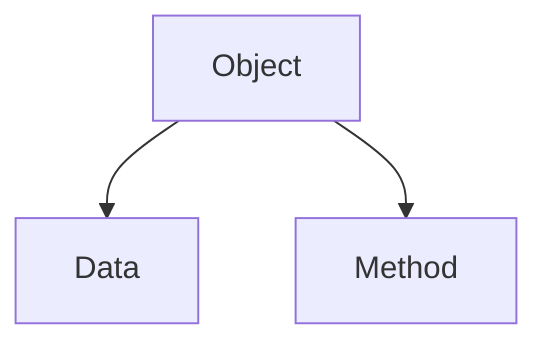

<br>
<br>
<br>
<br>
<br>
<br>

# Function & Class
Borworntat Dendumrongkul

---

# Function

## What is Function?

<br>

Function is a block of code which only runs when it is called.

```py
def say_something(x: int, text: str):
	i = 0
	while i != x:
		print(text)
		i += 1
```
---

## How to define Function?

|syntax|definition|
|---|---|
|``def``|define used to define a function|
|``args``|argument(s) [optional]|
|``return <data>``| return data [optional]|

---

## How to define Function?

syntax:
```py
def <name> (<args>):
	# do something
	return # optional
```

<br>
example: 
```py
def func(a, b):
	return (a + b) // 20
```

---

## How to define Function?

``args`` with fixed data type  
syntax:
```py
def <name>(<variable-name>: <datatype>, ...):
	# do something
```
<br>
example:
```py
def func(a: int, b: int):
	return (a + b) // 20
```
---

## How to define Function?

function with return type like ``C/C++``  
syntax:
```py
def <name>(<args>) -> <datatype>:
	# do something
```
<br>
example:
```py
def func(a: int, b:int) -> int:
	return (a + b) // 20
```

---

## Why Function?

<br>
<br> 

```py {all|1-5|6-10}
a = [10, 23, 221, 23, 12, 32, 12, 234]
x = 32
for i in range(0, len(a), 1):
	if a[i] == x:
		print("Found at {}".format(i))
a = [293, 21, 391, 3903, 1, 2, 332, 1212]
x = 2
for i in range(0, len(a), 1):
	if a[i] == x:
		print("Found at {}".format(i))
```
---

## Why Function?

<br>
<br>

```py {all|1-5|6-7|all}
def find_number(a: list, x: int):
	for i in range(0, len(a), 1):
		if a[i] == x:
			print("Found at {}".format(i))

find_number([10, 23, 221, 23, 12, 32, 12, 234], 32)
find_number([293, 21, 391, 3903, 1, 2, 332, 1212], 2)
```
--- 

## Application of Function

### Recursion

$a_n = a_{n-1} + a_{n-2}$  
when $a_1 = 1$, $a_2 = 1$

```py
def a_n(n: int):
	if n == 1 or n == 2:
		return 1
	return a_n(n - 1) + a_n(n - 2)
```
---

## Application of Function

### Recursion

```mermaid
graph TD
    A[a_n(4)] --> B[a_n(3)]
    A --> C[a_n(2)]
    B --> D[a_n(2)]
    B --> E[a_n(1)]
```

---

## Application of Function

### Functional Programming

Normal Programming: 
```py
for i in range(1, n + 1, 1):
	print(i)
```

Functional Programming:
```py
def func(n: int): 
	if n == 0:
		return 
	func(n - 1)
	print(n)
```
---

## Application of Function

### Shorten Your Code!

```py
for i in range(1, 21, 1):
	for j in range(1, j + 1, 1): print(j, end=" ")
	print("")
for i in range(1, 21, 1):
	for j in range(1, j + 1, 1): print(j, end=" ")
	print("")
for i in range(1, 21, 1):
	for j in range(1, j + 1, 1): print(j, end=" ")
	print("")
```

---

# Class

## What is class?

Since ``Python`` is an **object oriented programming(OOP)** language. Almost every thing in ``Python`` is an object!



---

## What is class?

### Data

``Data`` which stores in the object.

### Method

``Function`` which created for the object.
---

## How to define class?

|syntax|definition|
|---|---|
|``class``|object in ``python``|

---

## How to define class?

<br>
syntax:
```py
class <name>:
	# methods & data
```

<br>
example:
```py
class student:
	# data
	name = str()
	age = int()

	# method
	def __init__(self, a: str, b: int):
		self.name = a
		self.age = b
```
---

## How to define class?

### What is ``__init__(self)``?

``__init(self, <args>)`` is an special function which called when create object.

<br>
syntax:
```py
...
	def __init__(self, a: str, b: int):
		self.name = a
		self.age = b
...
```

### What is ``self``?
``self`` is a syntax which being used to refer to **this** object.
---

## How to define class?

### How to create others function?

Other function can created in normal way but every function must have ``self`` as an argument.

<br>
syntax:
```py
	def <name>(self, <args>):
		# do something
```

<br>
example:
```py
...
	def get_name(self):
		return self.name
...
```
---

## Why class?

Class is being used to stores specific data since basic datatype cannot store these kind of data.  
e.g. student's data, node of linked list

<br>
example of student's data:
```py
class Student:
	name = [str() for i in range(2)]
	age = int()
	def __init__(self, name, surname, age):
		self.name = [name, surname]
		self.age = age
	def get_fullname(self):
		return self.name[0] + " " + self.name[1]
```
---
